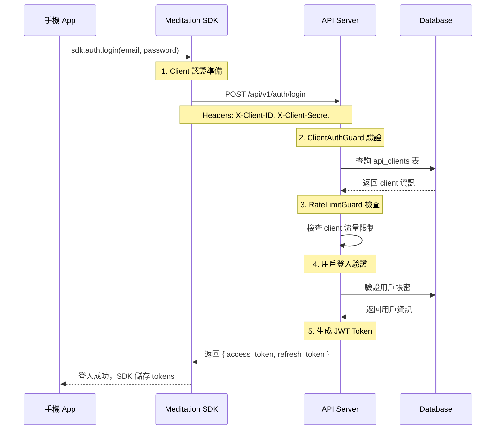
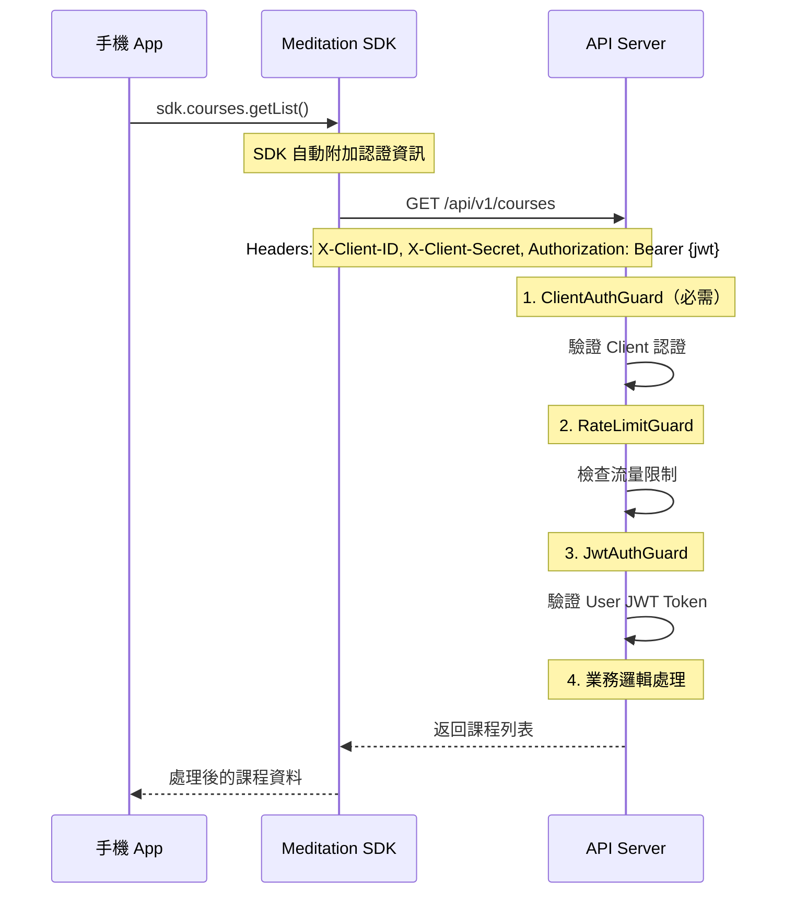

# 完整認證流程設計

## 認證層級架構

### 三層認證模型
```
1. Client 認證 (ClientAuthGuard)     - 驗證請求來源合法性
   ↓
2. Rate Limiting (RateLimitGuard)    - 基於 client_id 的流量控制
   ↓
3. User 認證 (JwtAuthGuard)          - 驗證用戶身份（按需）
```

## SDK 初始化和認證流程

### 1. SDK 初始化
```javascript
// 手機 SDK 初始化
const sdk = new MeditationSDK({
  apiBase: 'https://api.meditation.com',
  clientId: 'client-ios',        // 由 App Store 配置提供
  clientSecret: 'xxx',           // 從安全存儲讀取
  environment: 'production'
});
```

### 2. 用戶登入流程


### 3. 後續 API 請求流程


## 不同 API 的認證需求

### A. 只需要 Client 認證
```typescript
// 健康檢查、基本資訊等
@Get('health')
@SkipUserAuth()
async healthCheck() {
  // 只通過 ClientAuthGuard
  // 不需要用戶登入
}
```

### B. 需要雙重認證
```typescript
// 用戶個人資料、課程內容等
@Get('profile')
@UseGuards(JwtAuthGuard)
async getProfile() {
  // 通過 ClientAuthGuard + JwtAuthGuard
  // 需要 client 和 user 都認證
}
```

### C. 完全公開
```typescript
// 系統狀態、公開資訊等
@Get('status')
@SkipClientAuth()
@SkipUserAuth()
async getStatus() {
  // 跳過所有認證
}
```

## 認證失敗處理

### 1. Client 認證失敗
```json
{
  "statusCode": 401,
  "error": "Unauthorized",
  "message": "Invalid client credentials",
  "code": "CLIENT_AUTH_FAILED"
}
```

### 2. User 認證失敗
```json
{
  "statusCode": 401,
  "error": "Unauthorized", 
  "message": "Invalid or expired token",
  "code": "USER_AUTH_FAILED"
}
```

### 3. Rate Limit 超出
```json
{
  "statusCode": 429,
  "error": "Too Many Requests",
  "message": "Rate limit exceeded",
  "code": "RATE_LIMIT_EXCEEDED",
  "retryAfter": 60
}
```

## SDK 內部處理邏輯

### 1. 自動認證管理
```javascript
class MeditationSDK {
  constructor(config) {
    this.clientId = config.clientId;
    this.clientSecret = config.clientSecret;
    this.accessToken = null;
    this.refreshToken = null;
  }

  // 所有 API 請求都會自動附加認證
  async makeRequest(endpoint, options = {}) {
    const headers = {
      'X-Client-ID': this.clientId,
      'X-Client-Secret': this.clientSecret,
      'Content-Type': 'application/json',
      ...options.headers
    };

    // 如果有用戶 token，自動加上
    if (this.accessToken) {
      headers['Authorization'] = `Bearer ${this.accessToken}`;
    }

    try {
      const response = await fetch(`${this.apiBase}${endpoint}`, {
        ...options,
        headers
      });

      // 處理認證錯誤
      if (response.status === 401) {
        const error = await response.json();
        
        if (error.code === 'CLIENT_AUTH_FAILED') {
          // Client 認證失敗 - 可能是配置問題
          this.emit('clientAuthError', error);
          throw new Error('Client authentication failed');
        }
        
        if (error.code === 'USER_AUTH_FAILED') {
          // Token 過期，嘗試刷新
          const refreshed = await this.refreshAccessToken();
          if (refreshed) {
            // 重試原請求
            return this.makeRequest(endpoint, options);
          } else {
            // 刷新也失敗，需要重新登入
            this.emit('authRequired');
            throw new Error('Authentication required');
          }
        }
      }

      return response;
    } catch (error) {
      this.handleApiError(error);
      throw error;
    }
  }
}
```

### 2. Token 自動刷新
```javascript
async refreshAccessToken() {
  if (!this.refreshToken) {
    return false;
  }

  try {
    const response = await fetch(`${this.apiBase}/api/v1/auth/refresh`, {
      method: 'POST',
      headers: {
        'X-Client-ID': this.clientId,
        'X-Client-Secret': this.clientSecret,
        'Content-Type': 'application/json'
      },
      body: JSON.stringify({
        refresh_token: this.refreshToken
      })
    });

    if (response.ok) {
      const data = await response.json();
      this.accessToken = data.access_token;
      this.refreshToken = data.refresh_token;
      
      // 更新本地存儲
      await this.saveTokensSecurely();
      return true;
    }
  } catch (error) {
    console.error('Token refresh failed:', error);
  }

  return false;
}
```

## 安全最佳實踐

1. **Client Secret 保護**：
   - 移動端：使用 Keychain/Keystore 安全存儲
   - Web 端：避免在前端暴露，考慮使用 BFF 模式

2. **Token 管理**：
   - 使用短期 access_token（15-30 分鐘）
   - 長期 refresh_token（7-30 天）
   - 安全存儲和自動刷新

3. **請求安全**：
   - 強制 HTTPS
   - 實施 Certificate Pinning
   - 考慮請求簽名機制

4. **監控和告警**：
   - 異常認證模式告警
   - Client 使用統計分析
   - 安全事件記錄和追蹤