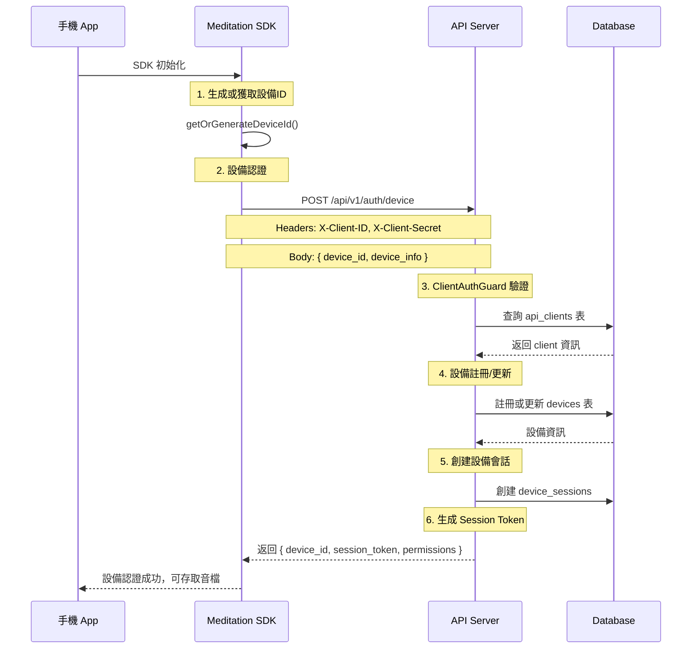
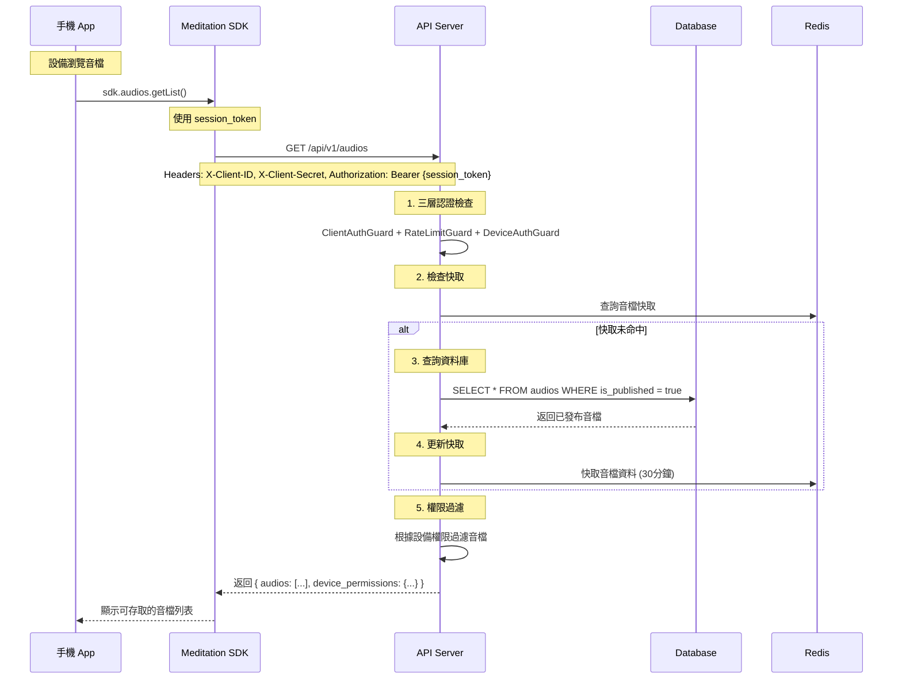
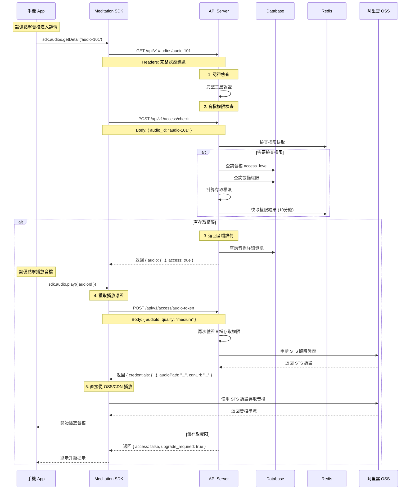
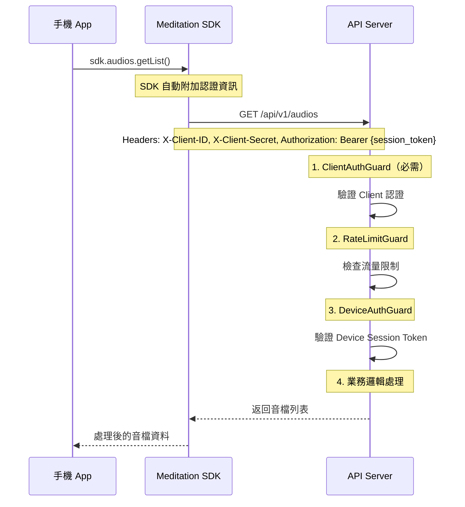

# 完整認證流程設計

## 認證層級架構

### 三層認證模型
```
1. Client 認證 (ClientAuthGuard)     - 驗證請求來源合法性
   ↓
2. Rate Limiting (RateLimitGuard)    - 基於 client_id 的流量控制
   ↓
3. Device 認證 (DeviceAuthGuard)     - 驗證設備身份
```

## SDK 初始化和認證流程

### 1. SDK 初始化
```javascript
// 手機 SDK 初始化
const sdk = new MeditationSDK({
  apiBase: 'https://api.meditation.com',
  clientId: 'client-ios',        // 由 App Store 配置提供
  clientSecret: 'xxx',           // 從安全存儲讀取
  environment: 'production'
});
```

### 2. 設備認證流程


## 業務流程示例 - 取得音檔

### 3. 設備瀏覽音檔流程


### 4. 音檔詳情和播放流程


### 5. 後續 API 請求流程


## 不同 API 的認證需求

### A. 只需要 Client 認證
```typescript
// 健康檢查、基本資訊等
@Get('health')
@SkipDeviceAuth()
async healthCheck() {
  // 只通過 ClientAuthGuard
  // 不需要設備認證
}
```

### B. 需要完整認證
```typescript
// 音檔內容、播放等
@Get('audios')
@UseGuards(DeviceAuthGuard)
async getAudios() {
  // 通過 ClientAuthGuard + DeviceAuthGuard
  // 需要 client 和 device 都認證
}
```

### C. 完全公開
```typescript
// 系統狀態、公開資訊等
@Get('status')
@SkipClientAuth()
@SkipDeviceAuth()
async getStatus() {
  // 跳過所有認證
}
```

## 認證失敗處理

### 1. Client 認證失敗
```json
{
  "statusCode": 401,
  "error": "Unauthorized",
  "message": "Invalid client credentials",
  "code": "CLIENT_AUTH_FAILED"
}
```

### 2. Device 認證失敗
```json
{
  "statusCode": 401,
  "error": "Unauthorized", 
  "message": "Invalid or expired device token",
  "code": "DEVICE_AUTH_FAILED"
}
```

### 3. Rate Limit 超出
```json
{
  "statusCode": 429,
  "error": "Too Many Requests",
  "message": "Rate limit exceeded",
  "code": "RATE_LIMIT_EXCEEDED",
  "retryAfter": 60
}
```

### 4. 音檔存取相關錯誤

#### 4a. 音檔不存在
```json
{
  "statusCode": 404,
  "error": "Not Found",
  "message": "Audio not found",
  "code": "AUDIO_NOT_FOUND"
}
```

#### 4b. 音檔存取權限不足
```json
{
  "statusCode": 403,
  "error": "Forbidden",
  "message": "Insufficient permission to access this audio",
  "code": "AUDIO_ACCESS_DENIED",
  "required_subscription": "premium"
}
```

#### 4c. STS 憑證獲取失敗
```json
{
  "statusCode": 500,
  "error": "Internal Server Error",
  "message": "Failed to generate audio access token",
  "code": "STS_TOKEN_FAILED"
}
```

## SDK 內部處理邏輯

### 1. 自動認證管理
```javascript
class MeditationSDK {
  constructor(config) {
    this.clientId = config.clientId;
    this.clientSecret = config.clientSecret;
    this.deviceId = this.getOrGenerateDeviceId();
    this.sessionToken = null;      // 設備會話 token
    this.deviceInfo = null;
  }

  // 設備認證
  async authenticateDevice() {
    const response = await this.makeRequest('/api/v1/auth/device', {
      method: 'POST',
      body: JSON.stringify({
        device_id: this.deviceId,
        device_info: this.getDeviceInfo()
      })
    });

    const data = await response.json();
    this.sessionToken = data.data.session_token;
    this.deviceInfo = data.data.device;
    
    await this.saveSession();
    this.emit('deviceAuthenticated', data.data);
    return data.data;
  }

  // 檢查設備狀態
  isAuthenticated() {
    return !!this.sessionToken;
  }

  // 音檔相關方法
  async getAudioList() {
    const response = await this.makeRequest('/api/v1/audios');
    const data = await response.json();
    return data.data;
  }

  async getAudioDetail(audioId) {
    const response = await this.makeRequest(`/api/v1/audios/${audioId}`);
    const data = await response.json();
    return data.data;
  }

  async checkAudioAccess(audioId) {
    const response = await this.makeRequest('/api/v1/access/check', {
      method: 'POST',
      body: JSON.stringify({ audio_id: audioId })
    });
    const data = await response.json();
    return data.data;
  }

  async getAudioToken(audioId, quality = 'medium') {
    const response = await this.makeRequest('/api/v1/access/audio-token', {
      method: 'POST',
      body: JSON.stringify({ audioId, quality })
    });
    const data = await response.json();
    return data.data;
  }

  // 播放音檔的完整流程
  async playAudio(audioId, quality = 'medium') {
    try {
      // 1. 檢查音檔權限
      const accessCheck = await this.checkAudioAccess(audioId);
      if (!accessCheck.access) {
        throw new Error('無權限存取此音檔');
      }

      // 2. 獲取播放憑證
      const tokenData = await this.getAudioToken(audioId, quality);
      
      // 3. 記錄播放開始
      await this.makeRequest('/api/v1/playback/start', {
        method: 'POST',
        body: JSON.stringify({
          audio_id: audioId,
          quality
        })
      });

      // 4. 返回播放資訊
      return {
        audioUrl: tokenData.cdnUrl,
        credentials: tokenData.credentials,
        sessionId: this.generateSessionId()
      };
    } catch (error) {
      this.emit('playbackError', { audioId, error });
      throw error;
    }
  }

  // 所有 API 請求都會自動附加認證
  async makeRequest(endpoint, options = {}) {
    const headers = {
      'X-Client-ID': this.clientId,
      'X-Client-Secret': this.clientSecret,
      'Content-Type': 'application/json',
      ...options.headers
    };

    // 附加設備 token
    if (this.sessionToken) {
      headers['Authorization'] = `Bearer ${this.sessionToken}`;
    }

    try {
      const response = await fetch(`${this.apiBase}${endpoint}`, {
        ...options,
        headers
      });

      // 處理認證錯誤
      if (response.status === 401) {
        const error = await response.json();
        
        if (error.code === 'CLIENT_AUTH_FAILED') {
          this.emit('clientAuthError', error);
          throw new Error('Client authentication failed');
        }
        
        if (error.code === 'DEVICE_AUTH_FAILED') {
          // Token 過期，重新認證
          const refreshed = await this.authenticateDevice();
          if (refreshed) {
            // 重試原請求
            return this.makeRequest(endpoint, options);
          } else {
            this.emit('authRequired');
            throw new Error('Device authentication required');
          }
        }
      }

      return response;
    } catch (error) {
      this.handleApiError(error);
      throw error;
    }
  }
}
```

### 2. Token 自動更新
```javascript
async refreshDeviceToken() {
  if (!this.deviceId) {
    return false;
  }

  try {
    const response = await this.authenticateDevice();
    return !!response;
  } catch (error) {
    console.error('Device token refresh failed:', error);
    return false;
  }
}
```

## 安全最佳實踐

1. **Client Secret 保護**：
   - 移動端：使用 Keychain/Keystore 安全存儲
   - Web 端：避免在前端暴露，考慮使用 BFF 模式

2. **Token 管理**：
   - 使用短期 session_token（2-4 小時）
   - 自動重新認證機制
   - 安全存儲和自動更新

3. **請求安全**：
   - 強制 HTTPS
   - 實施 Certificate Pinning
   - 考慮請求簽名機制

4. **監控和告警**：
   - 異常認證模式告警
   - Client 使用統計分析
   - 安全事件記錄和追蹤