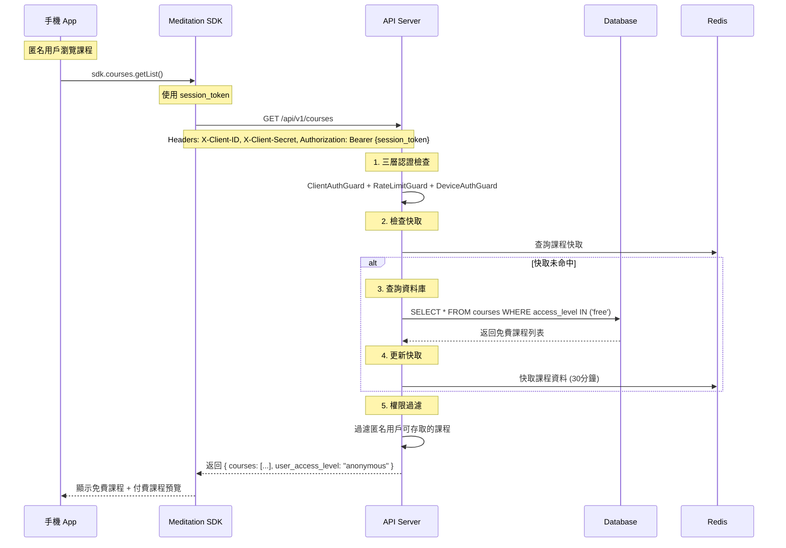
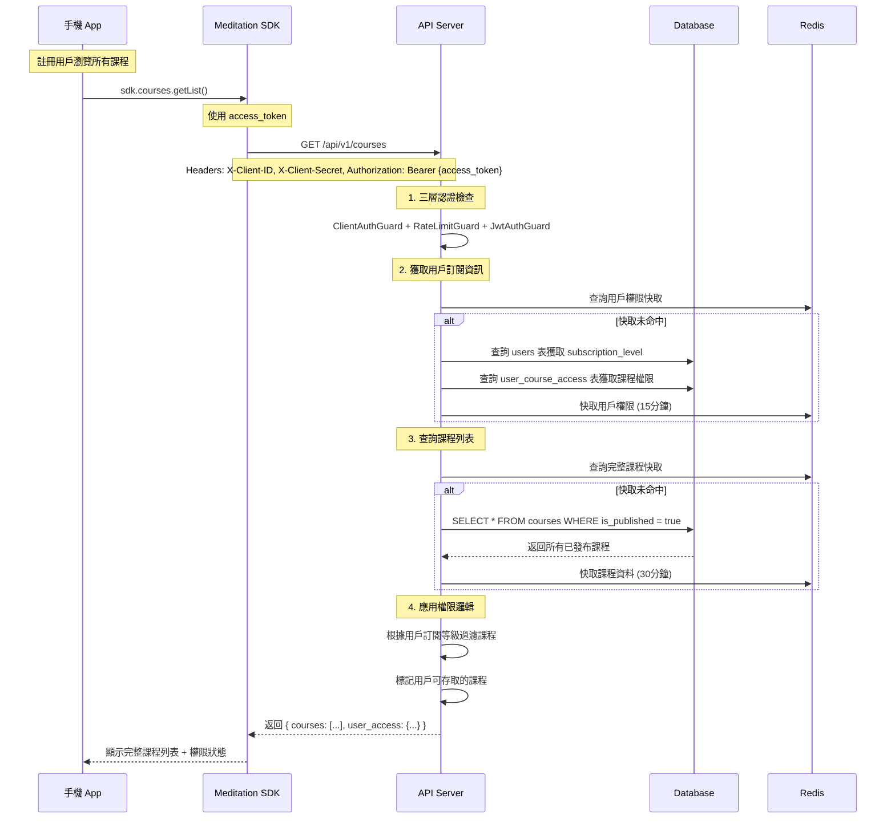
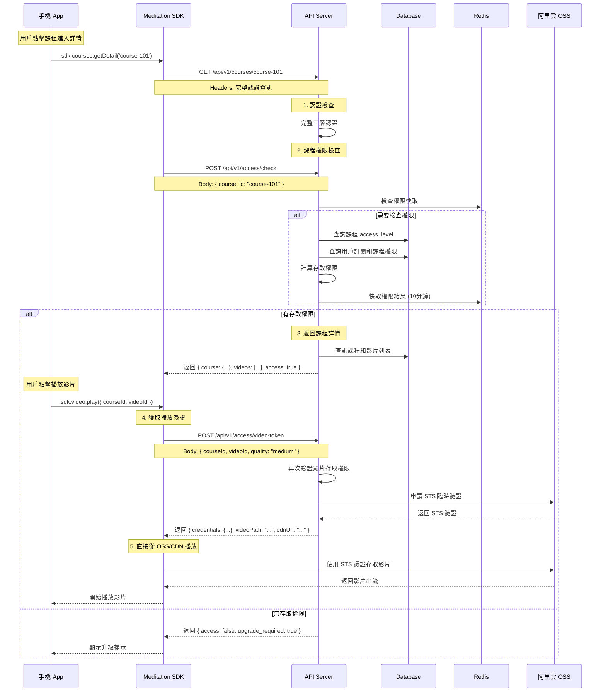

# 完整認證流程設計

## 認證層級架構

### 三層認證模型
```
1. Client 認證 (ClientAuthGuard)     - 驗證請求來源合法性
   ↓
2. Rate Limiting (RateLimitGuard)    - 基於 client_id 的流量控制
   ↓
3. User 認證 (JwtAuthGuard)          - 驗證用戶身份（按需）
```

## SDK 初始化和認證流程

### 1. SDK 初始化
```javascript
// 手機 SDK 初始化
const sdk = new MeditationSDK({
  apiBase: 'https://api.meditation.com',
  clientId: 'client-ios',        // 由 App Store 配置提供
  clientSecret: 'xxx',           // 從安全存儲讀取
  environment: 'production'
});
```

### 2. 設備匿名認證流程


### 3. Email 綁定認證流程


### 4. 已綁定用戶登入流程


## 業務流程示例 - 取得課程

### 5. 匿名用戶瀏覽課程流程


### 6. 註冊用戶取得完整課程流程


### 7. 課程詳情和影片權限檢查流程


### 3. 後續 API 請求流程


## 不同 API 的認證需求

### A. 只需要 Client 認證
```typescript
// 健康檢查、基本資訊等
@Get('health')
@SkipUserAuth()
async healthCheck() {
  // 只通過 ClientAuthGuard
  // 不需要用戶登入
}
```

### B. 需要雙重認證
```typescript
// 用戶個人資料、課程內容等
@Get('profile')
@UseGuards(JwtAuthGuard)
async getProfile() {
  // 通過 ClientAuthGuard + JwtAuthGuard
  // 需要 client 和 user 都認證
}
```

### C. 完全公開
```typescript
// 系統狀態、公開資訊等
@Get('status')
@SkipClientAuth()
@SkipUserAuth()
async getStatus() {
  // 跳過所有認證
}
```

## 認證失敗處理

### 1. Client 認證失敗
```json
{
  "statusCode": 401,
  "error": "Unauthorized",
  "message": "Invalid client credentials",
  "code": "CLIENT_AUTH_FAILED"
}
```

### 2. User 認證失敗
```json
{
  "statusCode": 401,
  "error": "Unauthorized", 
  "message": "Invalid or expired token",
  "code": "USER_AUTH_FAILED"
}
```

### 3. Rate Limit 超出
```json
{
  "statusCode": 429,
  "error": "Too Many Requests",
  "message": "Rate limit exceeded",
  "code": "RATE_LIMIT_EXCEEDED",
  "retryAfter": 60
}
```

### 4. Email 認證相關錯誤

#### 4a. Email 已存在 (註冊時)
```json
{
  "statusCode": 409,
  "error": "Conflict",
  "message": "Email already registered",
  "code": "EMAIL_ALREADY_EXISTS"
}
```

#### 4b. Email 不存在 (登入時)
```json
{
  "statusCode": 404,
  "error": "Not Found", 
  "message": "Email not found",
  "code": "EMAIL_NOT_FOUND"
}
```

#### 4c. 密碼錯誤
```json
{
  "statusCode": 401,
  "error": "Unauthorized",
  "message": "Invalid email or password",
  "code": "INVALID_CREDENTIALS"
}
```

#### 4d. Email 格式錯誤
```json
{
  "statusCode": 400,
  "error": "Bad Request",
  "message": "Invalid email format",
  "code": "INVALID_EMAIL_FORMAT"
}
```

#### 4e. 密碼強度不足
```json
{
  "statusCode": 400,
  "error": "Bad Request",
  "message": "Password must be at least 8 characters",
  "code": "WEAK_PASSWORD"
}
```

### 5. 課程存取相關錯誤

#### 5a. 課程不存在
```json
{
  "statusCode": 404,
  "error": "Not Found",
  "message": "Course not found",
  "code": "COURSE_NOT_FOUND"
}
```

#### 5b. 課程存取權限不足
```json
{
  "statusCode": 403,
  "error": "Forbidden",
  "message": "Insufficient permission to access this course",
  "code": "COURSE_ACCESS_DENIED",
  "required_subscription": "premium"
}
```

#### 5c. 影片不存在
```json
{
  "statusCode": 404,
  "error": "Not Found",
  "message": "Video not found",
  "code": "VIDEO_NOT_FOUND"
}
```

#### 5d. STS 憑證獲取失敗
```json
{
  "statusCode": 500,
  "error": "Internal Server Error",
  "message": "Failed to generate video access token",
  "code": "STS_TOKEN_FAILED"
}
```

#### 5e. 訂閱已過期
```json
{
  "statusCode": 402,
  "error": "Payment Required",
  "message": "Subscription has expired",
  "code": "SUBSCRIPTION_EXPIRED",
  "expired_at": "2025-07-15T00:00:00Z"
}
```

## SDK 內部處理邏輯

### 1. 自動認證管理
```javascript
class MeditationSDK {
  constructor(config) {
    this.clientId = config.clientId;
    this.clientSecret = config.clientSecret;
    this.deviceId = this.getOrGenerateDeviceId();
    this.sessionToken = null;      // 設備會話 token
    this.accessToken = null;       // 用戶 access token  
    this.refreshToken = null;      // 用戶 refresh token
    this.userInfo = null;
  }

  // 設備匿名登入
  async loginAnonymous() {
    const response = await this.makeRequest('/api/v1/auth/device', {
      method: 'POST',
      body: JSON.stringify({
        device_id: this.deviceId,
        device_info: this.getDeviceInfo()
      })
    });

    const data = await response.json();
    this.sessionToken = data.data.session_token;
    this.userInfo = data.data.user;
    
    await this.saveSession();
    this.emit('anonymousLogin', data.data);
    return data.data;
  }

  // Email 綁定
  async bindEmail(email, password) {
    if (!this.sessionToken) {
      throw new Error('需要先進行設備認證');
    }

    const response = await this.makeRequest('/api/v1/auth/bind', {
      method: 'POST',
      headers: {
        'Authorization': `Bearer ${this.sessionToken}`
      },
      body: JSON.stringify({
        auth_type: 'email',
        email,
        password
      })
    });

    const data = await response.json();
    
    // 升級為完整用戶 token
    this.userInfo = data.data.user;
    this.accessToken = data.data.access_token;
    this.refreshToken = data.data.refresh_token;
    
    await this.saveSession();
    this.emit('userUpgraded', this.userInfo);
    return data.data;
  }

  // Email 登入 (新設備)
  async loginWithEmail(email, password) {
    const response = await this.makeRequest('/api/v1/auth/login', {
      method: 'POST',
      body: JSON.stringify({
        device_id: this.deviceId,
        auth_type: 'email',
        email,
        password
      })
    });

    const data = await response.json();
    
    this.userInfo = data.data.user;
    this.accessToken = data.data.access_token;
    this.refreshToken = data.data.refresh_token;
    
    await this.saveSession();
    this.emit('userLogin', this.userInfo);
    return data.data;
  }

  // 檢查用戶狀態
  isAnonymous() {
    return !this.userInfo || this.userInfo.type === 'anonymous';
  }

  isRegistered() {
    return this.userInfo && this.userInfo.type === 'registered';
  }

  // 課程相關方法
  async getCourseList() {
    const response = await this.makeRequest('/api/v1/courses');
    const data = await response.json();
    return data.data;
  }

  async getCourseDetail(courseId) {
    const response = await this.makeRequest(`/api/v1/courses/${courseId}`);
    const data = await response.json();
    return data.data;
  }

  async checkCourseAccess(courseId) {
    const response = await this.makeRequest('/api/v1/access/check', {
      method: 'POST',
      body: JSON.stringify({ course_id: courseId })
    });
    const data = await response.json();
    return data.data;
  }

  async getVideoToken(courseId, videoId, quality = 'medium') {
    const response = await this.makeRequest('/api/v1/access/video-token', {
      method: 'POST',
      body: JSON.stringify({ courseId, videoId, quality })
    });
    const data = await response.json();
    return data.data;
  }

  // 播放影片的完整流程
  async playVideo(courseId, videoId, quality = 'medium') {
    try {
      // 1. 檢查課程權限
      const accessCheck = await this.checkCourseAccess(courseId);
      if (!accessCheck.access) {
        throw new Error('無權限存取此課程');
      }

      // 2. 獲取播放憑證
      const tokenData = await this.getVideoToken(courseId, videoId, quality);
      
      // 3. 記錄播放開始
      await this.makeRequest('/api/v1/playback/start', {
        method: 'POST',
        body: JSON.stringify({
          course_id: courseId,
          video_id: videoId,
          quality
        })
      });

      // 4. 返回播放資訊
      return {
        videoUrl: tokenData.cdnUrl,
        credentials: tokenData.credentials,
        sessionId: this.generateSessionId()
      };
    } catch (error) {
      this.emit('playbackError', { courseId, videoId, error });
      throw error;
    }
  }

  // 所有 API 請求都會自動附加認證
  async makeRequest(endpoint, options = {}) {
    const headers = {
      'X-Client-ID': this.clientId,
      'X-Client-Secret': this.clientSecret,
      'Content-Type': 'application/json',
      ...options.headers
    };

    // 根據用戶狀態選擇合適的 token
    if (this.accessToken) {
      // 已綁定用戶：使用 access_token
      headers['Authorization'] = `Bearer ${this.accessToken}`;
    } else if (this.sessionToken) {
      // 匿名設備：使用 session_token
      headers['Authorization'] = `Bearer ${this.sessionToken}`;
    }

    try {
      const response = await fetch(`${this.apiBase}${endpoint}`, {
        ...options,
        headers
      });

      // 處理認證錯誤
      if (response.status === 401) {
        const error = await response.json();
        
        if (error.code === 'CLIENT_AUTH_FAILED') {
          // Client 認證失敗 - 可能是配置問題
          this.emit('clientAuthError', error);
          throw new Error('Client authentication failed');
        }
        
        if (error.code === 'USER_AUTH_FAILED') {
          // Token 過期，嘗試刷新
          const refreshed = await this.refreshAccessToken();
          if (refreshed) {
            // 重試原請求
            return this.makeRequest(endpoint, options);
          } else {
            // 刷新也失敗，需要重新登入
            this.emit('authRequired');
            throw new Error('Authentication required');
          }
        }
      }

      return response;
    } catch (error) {
      this.handleApiError(error);
      throw error;
    }
  }
}
```

### 2. Token 自動刷新
```javascript
async refreshAccessToken() {
  if (!this.refreshToken) {
    return false;
  }

  try {
    const response = await fetch(`${this.apiBase}/api/v1/auth/refresh`, {
      method: 'POST',
      headers: {
        'X-Client-ID': this.clientId,
        'X-Client-Secret': this.clientSecret,
        'Content-Type': 'application/json'
      },
      body: JSON.stringify({
        refresh_token: this.refreshToken
      })
    });

    if (response.ok) {
      const data = await response.json();
      this.accessToken = data.access_token;
      this.refreshToken = data.refresh_token;
      
      // 更新本地存儲
      await this.saveTokensSecurely();
      return true;
    }
  } catch (error) {
    console.error('Token refresh failed:', error);
  }

  return false;
}
```

## 安全最佳實踐

1. **Client Secret 保護**：
   - 移動端：使用 Keychain/Keystore 安全存儲
   - Web 端：避免在前端暴露，考慮使用 BFF 模式

2. **Token 管理**：
   - 使用短期 access_token（15-30 分鐘）
   - 長期 refresh_token（7-30 天）
   - 安全存儲和自動刷新

3. **請求安全**：
   - 強制 HTTPS
   - 實施 Certificate Pinning
   - 考慮請求簽名機制

4. **監控和告警**：
   - 異常認證模式告警
   - Client 使用統計分析
   - 安全事件記錄和追蹤